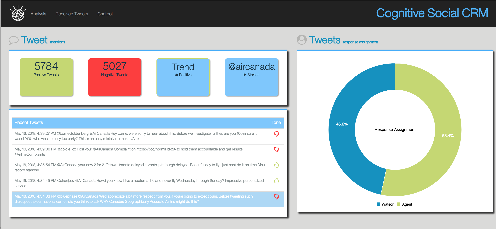
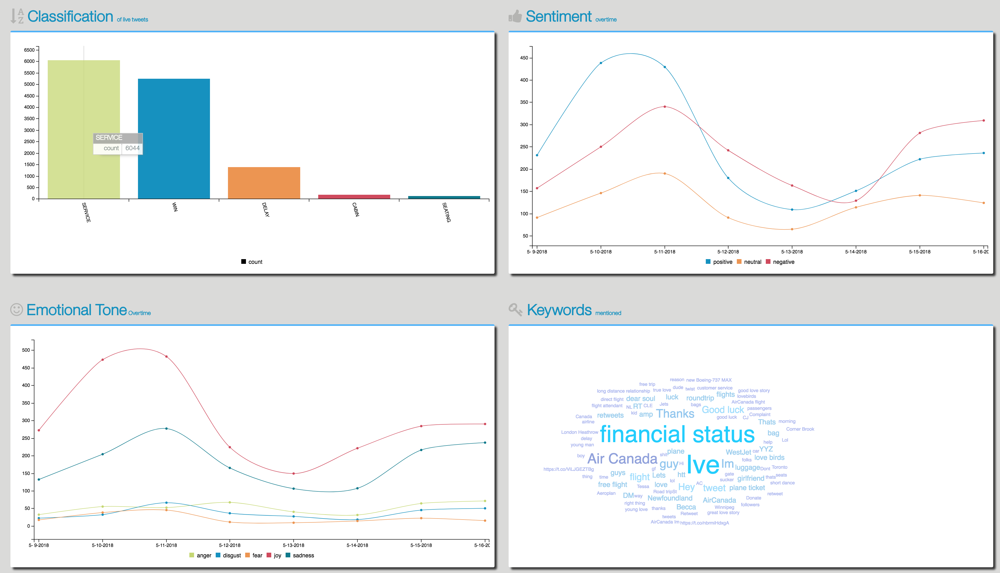

*他の言語で読む: [English](README.md).*

[](https://travis-ci.org/IBM/cognitive-social-crm)

# Watson Assistant、Tone Analyzer、Natural Language Understandingを使用して、Twitterフィードから顧客のセンチメントをより良く理解する

> Watson Conversation は現在 Watson Assistant に名称が変更されています。このコードパターンの一部のイメージでは、サービス名が Watson Conversation と表示されたままのものがありますが、手順とプロセスは引き続き機能します。

このパターンでは、ある特定のユーザーによって構成された Twitter フィードをサーバー・アプリケーションがサブスクライブし、受信する各ツイートのセンチメントと感情を分析します。さらに、Watson Assistant サービスによってツイートのインテント (発言の意図) を判断します。すべてのデータは Cloudant データベース内に保管されます。Cloudant データベースであれば、履歴データを保管することもできます。処理後の情報は、Web UI 内の一連のグラフとチャートに表示されます。元のコードと文書の著者 [Werner Vanzyl](https://www.linkedin.com/in/werner-vanzyl-326a589) の貢献に感謝します。

このコード・パターンをひと通り完了すると、以下の方法がわかるようになります。

* Twitter フィードをモニターするアプリケーションを実行する。
* ツイートを Watson Tone Analyzer、Watson Assistant、Watson Natural Language Understanding の各サービスに送信し、処理して分析する。
* 情報を Cloudant データベース内に保管する。
* 情報を Node.js の Web UI 内に表示する。
* 特定のTwitterハンドルまたはハッシュタグのソーシャルメディアをキャプチャして分析し、Watsonにコンテンツを分析させる。

## Flow


1. Twitter からツイートがプッシュされます。
2. Cognitive Social CRM アプリ(server.js)がツイートを処理します。
3. Watson Tone Analyzer Service がセンチメントと感情を分析します。
4. Watson Natural Language Understanding Service がキーワードとエンティティーを抽出します。
5. Watson Assistant Service がツイートからインテント(動詞)を抽出します。
6. ツイートとメタデータが Cloudant 内に保管されます。
7. Web UI にチャートとグラフならびにツイートが表示されます。

## 含まれるコンポーネント

* [Watson Assistant](https://www.ibm.com/watson/jp-ja/developercloud/conversation.html): モバイルデバイス、メッセージングプラットフォーム、物理的なロボットなどに、ボットまたは仮想エージェントを構築、テスト、および展開します。
* [Watson Tone Analyzer](https://www.ibm.com/watson/jp-ja/developercloud/tone-analyzer.html): 言語分析を使用して、文章テキストに表れるトーンや感情を分析します。
* [Watson Natural Language Understanding](https://www.ibm.com/watson/services/natural-language-understanding/): 高度なテキスト解析のための自然言語処理。
* [IBM Cloudant](https://www.ibm.com/analytics/us/en/technology/cloud-data-services/cloudant): 管理されたNoSQLデータベースサービス。アプリケーションデータを、必要なすべての場所で提供します。オフラインまたはオンラインの中断のないデータアクセスです。
* [Cloud Foundry](http://cloudfoundry.org/): オープンソースのクラウドプラットフォーム上でアプリケーションを構築、展開、実行します。

## 利用した技術

* [Artificial Intelligence](https://medium.com/ibm-data-science-experience): 人工知能を分散したソリューション空間に適用して、破壊的技術(新しい価値基準の下で従来よりも優れた特長を持つ新技術)を提供します。
* [Databases](https://en.wikipedia.org/wiki/IBM_Information_Management_System#.22Full_Function.22_databases): データの収集を格納および管理するためのリポジトリ。
* [Node.js](https://nodejs.org/): サーバー側でJavaScriptコードを実行するためのオープンソースのJavaScriptランタイム環境。

# ビデオを観る

[](https://youtu.be/aWKi4f6gytc)

# 手順

セットアップは3つの主要なステップで行われます。コードをダウンロードし、アプリケーションをセットアップし、コードを IBM Cloud にデプロイします。コードをローカルで実行する場合は、ローカルで資格情報を設定するもう1つのステップがあります。

1. [リポジトリをクローンする](#1-clone-the-repo)
2. [必要なソフトウェアのインストール](#2-install-dependencies)
3. [Twitterの要件](#3-twitter-requirements)
4. [IBM Cloud で Watson サービスを作成する](#4-create-watson-services-with-ibm-cloud)
5. [Assistant ワークスペースをインポートする](#5-import-the-conversation-workspace)
6. [資格情報を構成する](#6-configure-credentials)
7. [アプリケーションを実行する](#7-run-the-application)

<a name="1-clone-the-repo"></a>
### 1. リポジトリをクローンする

`cognitive-social-CRM` をローカルにクローンします。ターミナルで、次のコマンドを実行します。

```
$ git clone https://github.com/IBM/cognitive-social-crm
$ cd cognitive-social-crm
```
[`data/conversation/workspaces/workspace-social-crm-airline-classification.json`](data/conversation/workspaces/workspace-social-crm-airline-classification.json) ファイルを使用して、Watson Assistant ワークスペースを構成します。

<a name="2-install-dependencies"></a>
### 2. 必要なソフトウェアのインストール

アプリケーションでは、次のソフトウェアをローカルにインストールする必要があります。

1. [Node (6.9+)](https://nodejs.org): アプリケーションランタイム環境で、パッケージをダウンロードしてインストールします。
2. [Angular CLI (1.0.0)](https://www.npmjs.com/package/@angular/cli): Angular アプリケーションのコマンドラインインターフェイス(CLI) で `npm install -g @angular/cli` コマンドでインストールされます。

> Angular CLIが既にインストールされている場合、アップグレードする際には、Angular CLIのアップグレード手順をお読みください。

アプリケーションフォルダーから次のコマンドを実行して、クライアントとサーバーの両方に必要なパッケージをインストールします。

```
$ npm install
```

<a name="3-twitter-requirements"></a>
### 3. Twitterの要件

このアプリケーションで特定のハンドルまたはハッシュタグからツイートを購読するには、TwitterアカウントとTwitterアプリケーションを作成する必要があります。Twitterアカウントは、他のTwitterユーザーからのメッセージを受信するアカウントとして使用されるだけでなく、Twitterで必要なアプリケーションの所有者として使用され、ツイートを受信します。

* [Twitter](https://twitter.com/signup) で通常のTwitterアカウントを作成するか、既存のアカウントを使用することができます。作成には既存のTwitterアカウントにまだ関連付けられていない一意の電子メールIDと、アカウントを確認するための電話番号を入力する必要があります。
* Twitterアカウントを作成して確認したら、[Twitter Dev](https://apps.twitter.com/) にログインしてアプリケーションを作成します。
* `Keys and Access Tokens` タブを選択し、コンシューマーキーとシークレットを生成します。これらのトークンを後でアプリケーションの設定手順で使用する必要があるため、このページを開いたままにしておきます。

<a name="4-create-watson-services-with-ibm-cloud"></a>
### 4. IBM Cloud で Watson サービスを作成する

IBM Cloud デプロイメント、もしくは Local デプロイメントのいずれかを設定します。

#### IBM Cloud デプロイメントのセットアップ

> 説明: 最初に IBM Cloud にプレースホルダー・アプリケーションを作成し、必要なすべてのサービスを接続します。

1. IBM Cloudアカウントをまだお持ちでない場合は、 [サインアップ](https://console.bluemix.net/registration) してください。
2. [Cloud Foundry CLI](https://console.bluemix.net/docs/cli/index.html#cli) ツールをダウンロードしてインストールします。
3. IBM Cloud に自身のアカウントでログインします。
4. `Application Dashboard` から `Application` を新規作成します。
  - 左側にある `Apps` > `Cloudfoundry Apps` を選択。
  - 右側にある `SDK for Node.js` を選択。
  - アプリケーションにユニークな名前をつけます。
5. アプリケーションが作成されたら、アプリケーションに入り  `Connections` を選択します。
6. 必要なサービスを作成し、新しく作成したアプリケーションにバインドします: `Watson Assistant`、`Natural Language Understanding`、`Tone Analyzer`、`Cloudant NoSQL DB`。
7. 次のステップで資格情報を参照するので `Connections` ページを開いたままにしておきます。

#### Local デプロイメントのセットアップ

>説明: IBM Cloud サービスを作成し、ローカルに稼働するサーバー・アプリで使用するように構成します。

IBM Cloudアカウントをまだお持ちでない場合は、 [サインアップ](https://console.bluemix.net/registration) してください。ログインして以下のサービスを作成します。

* [**Watson Assistant**](https://console.bluemix.net/catalog/services/conversation)
* [**Watson Tone Analyzer**](https://console.bluemix.net/catalog/services/tone-analyzer)
* [**Watson Natural Language Understanding**](https://console.bluemix.net/catalog/services/natural-language-understanding)
* [**IBM Cloudant DB**](https://console.bluemix.net/catalog/services/cloudant-nosql-db)

<a name="5-import-the-conversation-workspace"></a>
### 5. Assistant ワークスペースをインポートする

**Watson Assistant** ツールを起動します。右側にある **import** アイコンボタンを使用してください。

ローカルにある [`data/conversation/workspaces/workspace-social-crm-airline-classification.json`](data/conversation/workspaces/workspace-social-crm-airline-classification.json) ファイルを選択して **Import** します。新しいワークスペースのコンテキストメニューから **View details** を実行し、**Workspace ID** を表示させます。このID値は後で使用しますので、保存しておいてください。

<a name="6-configure-credentials"></a>
### 6. 資格情報を構成する

アプリケーションを IBM Cloud またはローカルで実行する前に、`env-vars-example.json` ファイルを `env-vars.json` にコピーする必要があります。

> `env-vars.json` ファイルには、このアプリケーションのすべてのパラメータが保存されます。後で説明するセットアップユーティリティは、このファイルのいくつかのパラメータの設定をガイドしますが、いつでも戻って変更することができます。

#### サービスの資格情報を構成する

IBM Cloud サービス (Assistant、Tone Analyzer、Natural Language Understanding、Cloudant) の資格情報は、IBM Cloud の `` Services`` メニューにあります。サービスごとに `` Service Credentials`` オプションを選択してください。

アシスタントのその他の設定は、以前のセットアップ手順(``WORKSPACE_ID``)で収集されています。

[`env-vars-example.json`](env-vars-example.json) ファイルを `env-vars.json` にコピーします。

```
$ cp env-vars-example.json env-vars.json
```
`env-vars.json` ファイルを必要な設定で編集します。Cloudant と Twitter の設定は、次のステップで `npm run setup` を実行すると追加されます。これらの変数は必要に応じて手作業で編集できますが、Cloudantドキュメントを作成するにはセットアップユーティリティが必要です。

#### `env-vars-example.json:`

```
{

  "CLOUDANT_CONNECTION_URL": <populated by `npm run setup`>,
  "CLOUDANT_USERNAME": <populated by `npm run setup`>,
  "CLOUDANT_PASSWORD": <populated by `npm run setup`>,
  "CLOUDANT_ANALYSIS_DB_NAME": "analysis-db",
  "CLOUDANT_CONVERSATION_STATE_DB_NAME": "conversation-state-db",

  "CONVERSATION_API_URL": "",
  "CONVERSATION_API_USER": "",
  "CONVERSATION_API_PASSWORD": "",
  "CONVERSATION_CLASSIFICATION_WORKSPACE_ID": "",

  "NLU_API_USER": "",
  "NLU_API_PASSWORD": "",

  "TONE_ANALYZER_USER": "",
  "TONE_ANALYZER_PASSWORD": "",

  "TWITTER_CONSUMER_KEY": <populated by `npm run setup`>,
  "TWITTER_CONSUMER_SECRET": <populated by `npm run setup`>,
  "TWITTER_ACCESS_TOKEN": <populated by `npm run setup`>,
  "TWITTER_ACCESS_SECRET": <populated by `npm run setup`>,
  "TWITTER_LISTEN_FOR": "populated by `npm run setup`",
  "TWITTER_FILTER_FROM": "populated by `npm run setup`",
  "TWITTER_FILTER_CONTAINING": "populated by `npm run setup`",
  "TWITTER_PROCESS_RETWEETS": false,
  "TWITTER_RECEIVER_START_AT_BOOT": true,
  "TWITTER_CHATBOT_SCREENNAME": <populated by `npm run setup`,
  "TWITTER_CHATBOT_START_AT_BOOT": true
}

```

#### セットアップ用アプリケーションを実行する

ソーシャルCRMアプリケーションには、アプリケーションが必要とする設定ファイルを更新してCloudant DB文書を作成するために実行するセットアップユーティリティが含まれています。これを使用して、Twitterをテストしてデータベースを照会することもできます。

コードを格納するディレクトリ(事前にダウンロードしてcdしたディレクトリ)で次のコマンドを実行します。

```
$ npm run setup
```

セットアップユーティリティは、実行すべきいくつかのアクションで構成されています。

#### Cloudant

このアクションにより、アプリケーションを実行するために必要なデータベースが作成され、すべての設計文書と索引がロードされます。Cloudant のユーザー名とパスワードは、IBM Cloud 内の Cloudant サービスの資格情報で見つけることができます。

#### Twitter

このアクションは、Twitterに接続するだけでなく、つぶやきを購読するのに必要なパラメータで設定を更新します。dev.twitter.com からコンシューマーキー(APIキー)、コンシューマーシークレット(APIシークレット)、アクセストークン、アクセストークンシークレットを入手する必要があります。

この時点で、あなたがTwitterをどのように処理して「聞いている(listening)」かを決める必要があります。この旅の [Watson Assistant インテント](https://console.bluemix.net/docs/services/conversation/intents.html#defining-intents) は、航空会社の Twitter アカウントで動作するように設定されていますが、あなたが望むビジネスドメインの関連するインテントを作成できます。Twitterのハンドルは、他の人々がつぶやく宛先のようなものになります。たとえば、[`@aircanada`](https://twitter.com/AirCanada) です。この値は、Twitter があなたにツイートを送信するためのトリガーとして使用するものです。

>注記：大量のAPI呼び出しの可能性があるため、このアクセラレータは IBM Cloud への有料サブスクリプションで使用するのが効果的です。たくさんのつぶやきを生成するスクリーンネームにこのアクセラレータを使用しようとすると、API呼び出しの無償割り当てを非常に迅速に使い切る危険性があります。エンリッチメントパイプラインからエラーが返された場合、アクセラレータはつぶやきを聴くことを15分間停止します。UIでの受信者が一時停止されている場合は、通常、1日の上限を超えたことを意味します。

セットアップユーティリティのメインメニューで `Twitter` オプションを選択すると、まず Twitter トークンを入力する必要があります。リッスンしているスクリーンネーム、分類のアシスタントAPIワークスペースID、最後にダイアログ実装のChatbotスクリーンネームとアシスタントAPIワークスペースを入力します。

##### Twitter のテスト

次のオプションは、Twitterのパラメータをテストすることです。セットアップユーティリティのメインメニューからこのオプションを選択すると、リスナーが起動し、ツイートが受信され、コンソールに表示されます。パラメータの一部が正しくない場合は、エラーが表示されます。

##### Tweets を検索する

>注：この機能を利用するには、ローカルセットアップを完了する必要があります。

以前のツイートをデータベースに取り込みたいことがあります。このアクセラレータは、あなたの「聴く」スクリーンネームに合ったつぶやきを7日前まで遡って検索することができます。それはエンリッチメントを行い、つぶやきをデータベースに追加します。

<a name="7-run-the-application"></a>
### 7. アプリケーションを実行する

IBM Cloud上でアプリを実行する、またはアプリをローカルで実行する。

#### IBM Cloud上でアプリを実行する

Use the name of the application you created previously to update the configuration files locally.

以前に作成したアプリケーション名を使用して、構成ファイルをローカルに更新します。

1. `manifest.yml` ファイルを開き、`name` と `host` 値を以前に IBM Cloud で作成した一意のアプリケーション名に変更してください。

2. 次のコマンドを使用してAngular 2クライアントコードをコンパイルします。

  ```
  $ npm run build:client
  ```
3. コマンドライン・ツールで IBM Cloud に接続し、プロンプトに従って、ログインします

  ```
  $ cf login -a https://api.ng.bluemix.net
  ```
4. アプリケーションを IBM Cloud にプッシュします。

  ```
  $ cf push
  ```
5. アプリケーションは、IBMクラウド上で動作し、ツイートを聴いているはずです。アプリケーションURLには、 `manifest.yml` ファイルで定義したアプリケーション名を '.mybluemix.net' に追加してアクセスできます。

6. アプリケーションはユーザー名とパスワードで保護されています。詳細はこのREADMEの「アプリケーションにアクセスする」を参照してください。

#### アプリをローカルで実行する

すべての資格情報が設定されると、アプリケーションは次の方法で開始できます。

```
$ npm run develop
```

## アプリケーションにアクセスする

このアプリケーションに必要なユーザーは1人だけです。このユーザは、パスワードが `p@ssw0rd` の `watson` です。

ユーザー名とパスワードは `/server/boot/init-access.js` ファイルで変更できます。

## カスタマイズ

このアプリケーションでは、独自のTwitterのスクリーンネームを使用して監視すること、あなたが提供する会話のワークスペースを別にすること、などのカスタマイズができます。

1. サーバコンポーネントは `env-vars.json` ファイルで設定されます。
2. クライアントには `client/src/app/shared/config.service.ts` ファイルで変更できるいくつかの設定があります。

## サンプル出力

ツイートに関する情報が表示されます：



ライブなつぶやきの分類、時間の経過に伴う感情、時間の経過に伴う感情的な調子、言及されたキーワード：



# リンク
* [Watson Assistant](https://www.ibm.com/watson/jp-ja/developercloud/conversation.html)
* [Watson Tone Analyzer](https://www.ibm.com/watson/jp-ja/developercloud/tone-analyzer.html)
* [Watson Natural Language Understanding](https://www.ibm.com/watson/services/natural-language-understanding/)
* [IBM Cloudant db](https://www.ibm.com/cloud/cloudant)

# もっと学ぶ

* **Artificial Intelligence コードパターン**: このコードパターンを気に入りましたか？ [AI コードパターン](https://developer.ibm.com/jp/technologies/artificial-intelligence/) から関連パターンを参照してください。
* **AI and Data コードパターン・プレイリスト**: コードパターンに関係するビデオ全ての [プレイリスト](https://www.youtube.com/playlist?list=PLzUbsvIyrNfknNewObx5N7uGZ5FKH0Fde) です。
* **With Watson**: [With Watson](https://www.ibm.com/watson/jp-ja/with-watson/) プログラム は、自社のアプリケーションに Watson テクノロジーを有効的に組み込んでいる開発者や企業に、ブランディング、マーケティング、テクニカルに関するリソースを提供するプログラムです。

# ライセンス
[Apache 2.0](LICENSE)
